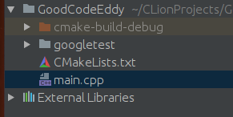
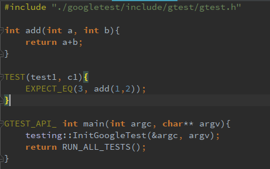
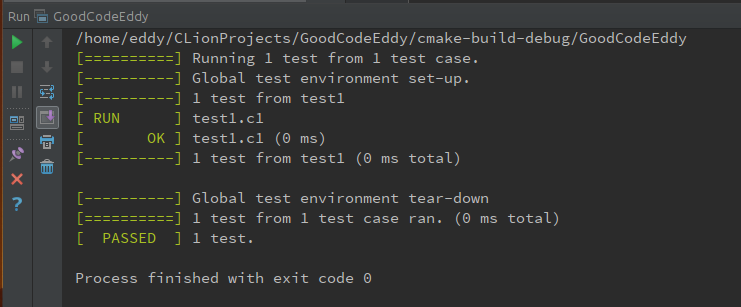

# CLion集成GTest的简单示例

Linux

通过简单的示例，将GTest测试框架集成到CLion工程中（验证环境为Linux）
* 工程目录视图

* CMakeList.txt

* main.c

* 测试结果

windows下报错

严重性	代码	说明	项目	文件	行	禁止显示状态	禁止显示状态
错误	LNK1104	无法打开文件“pthread.lib”	D:\visual studio 2015\Projects\GTest-CLion-example\CMakeLists.txt	D:\visual studio 2015\Projects\GTest-CLion-example\LINK	1		

''

https://github.com/Microsoft/vcpkg/issues/3482

'vcpkg install boost:x64-windows pthreads:x64-windows'
